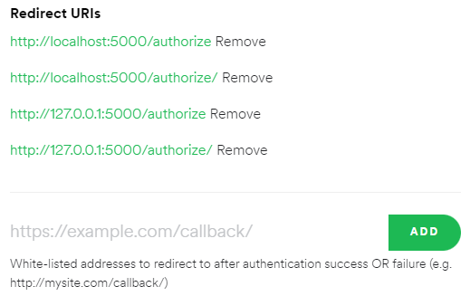
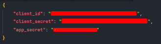
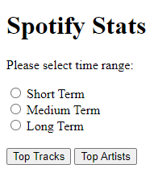

# Spotify Top Lists

This is a simple script that will get the current top lists of a user from the Spotify API and display them in a Flask app.

### Requirements
- You need to have a Spotify account.
- You need to have a Spotify developer application. (You can create one for free at [https://developer.spotify.com/](https://developer.spotify.com/dashboard/))
    - Login your spotify account.
    - Create an application.
    - Enter your account and click on to edit settings. And add these URIs.

        

- You need to install the Flask and spotipy packages.
    - ```pip install --upgrade flask spotipy```
- And a json file with your Spotify API id and secret, and app secret key.
    - You can get the id and secret from your [application](https://developer.spotify.com/dashboard/applications).

    

---

### Usage
- Download the repository and place the app.json file in the same folder.
- Open the repository foldes in terminal and run the following command:
    - ```flask run```
- You can now access the app at [http://localhost:5000/](http://localhost:5000/)
- Application redirects to Spotify login page.
- After login you can use the app.
- Select the time range and click one of the buttons to get the top list of artists or tracks.

    